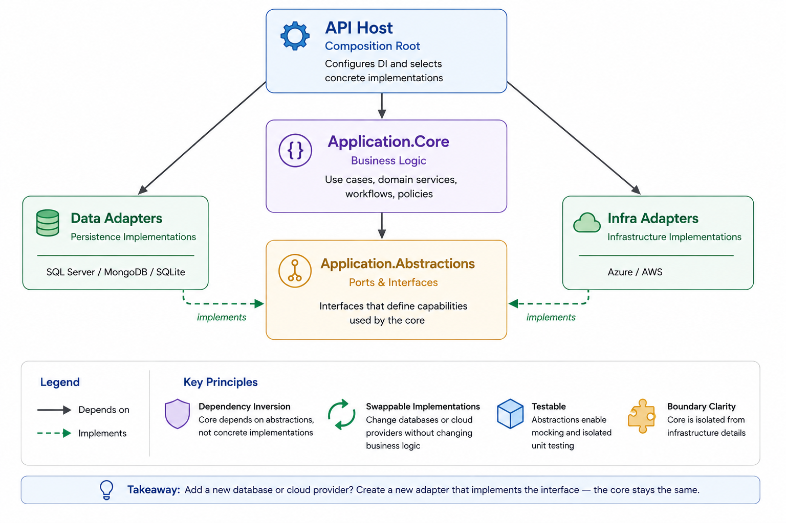

# MembershipPlatform

A modular .NET reference implementation demonstrating client, database, and
infrastructure independence through focused ports, replaceable adapters, and thin
vertical slices.

This production-minded reference implementation has intentionally limited business
scope. Business logic depends only on abstractions, while database and
infrastructure concerns are implemented as replaceable adapters. The API host acts
as the composition root, selecting concrete implementations through dependency
injection.

## Design goals

The implementation demonstrates independence at three system boundaries:

- **Client-independent** — Application use cases do not depend on HTTP, ASP.NET
  Core, JSON, controllers, or client-specific response models. The API maps
  Application results to explicit versioned HTTP contracts.
- **Database-independent** — Core and Application do not depend on SQL, ADO.NET
  providers, connection strings, or migrations. SQLite and SQL Server implement
  focused repository and query ports selected by the API composition root.
- **Infrastructure-independent** — Application depends on capability-specific
  ports rather than filesystem or cloud SDKs. Member-document storage currently
  uses a local adapter that can be replaced without changing the upload use case.

Independence means that business logic is insulated from these technologies. The
API host intentionally references concrete adapters because it is the composition
root where implementation choices are made.

## Architecture and dependency rules

```text
Client
  | HTTP
  v
MembershipPlatform.Api
  |
  v
MembershipPlatform.Application
  |
  v
MembershipPlatform.Core
  ^
  |
Persistence and infrastructure adapters implement Core ports
```

- Core references nothing.
- Application references only Core.
- Persistence and infrastructure adapters reference Core.
- API references Application and the concrete adapters it composes.
- Inner projects never reference API, persistence, or infrastructure projects.
- Connection strings, filesystem paths, SQL, and HTTP types remain at outer
  boundaries.

The following diagram illustrates the dependency-inversion principles guiding the
solution. Its component names are conceptual; the exact project dependencies are
listed below.



## Projects

- `MembershipPlatform.Core` has no project dependencies.
- `MembershipPlatform.Application` references Core.
- `MembershipPlatform.Data.Mongo` references Core and is an empty placeholder adapter.
- `MembershipPlatform.Data.Sqlite` references Core and is the default local adapter.
- `MembershipPlatform.Data.SqlServer` references Core.
- `MembershipPlatform.Storage.Local` implements member-document storage without
  exposing filesystem details to Application.
- `MembershipPlatform.Api` references Application and the concrete data adapters.
- `MembershipPlatform.Web` is an optional Razor Pages demonstration client. It
  communicates only through the versioned HTTP API and has no backend project
  references.
- `MembershipPlatform.Blazor` is an optional standalone Blazor WebAssembly client.
  It runs in the browser, communicates through the same HTTP API, and has no
  backend project references.
- `MembershipPlatform.Application.Tests` references Application and Core.
- `MembershipPlatform.Data.Sqlite.Tests` verifies the SQLite adapter against isolated
  temporary databases.
- `MembershipPlatform.Storage.Local.Tests` verifies storage against an isolated
  temporary directory.

Package versions are managed centrally in `Directory.Packages.props`. Shared build
properties are defined in `Directory.Build.props`.

## Ports and adapters

Core ports describe capabilities required by Application:

- **Repositories** support focused entity lookups and transactional writes.
- **Queries** support read operations that naturally require joins or projections.
- **Storage ports** describe external capabilities such as member-document storage.

Adapters contain the technology-specific behavior:

- SQLite and SQL Server contain ADO.NET, SQL, transaction, and locking behavior.
- Local document storage contains filesystem behavior and safe key generation.
- The API host selects concrete adapters through dependency injection.

The interfaces are deliberately capability-specific. The solution does not use a
generic repository, generic storage framework, or shared infrastructure service.

## Current vertical slices

| Capability | Application use case | Core port | Implementations |
| --- | --- | --- | --- |
| Check in member | `CheckInMember` | Member and check-in repositories | SQLite / SQL Server |
| Get member check-ins | `GetMemberCheckIns` | Check-in repository | SQLite / SQL Server |
| List classes | `GetClasses` | Class repository | SQLite / SQL Server |
| Register member for class | `RegisterMemberForClass` | Class-registration repository | SQLite / SQL Server |
| Get classes for member | `GetClassesForMember` | Member-class query | SQLite / SQL Server |
| Get members for class | `GetMembersForClass` | Class-registration query | SQLite / SQL Server |
| Get registration summary | `GetClassRegistrationSummary` | Class-registration query | SQLite / SQL Server |
| Upload member document | `UploadMemberDocument` | Member-document storage | Local filesystem |

Class registration performs a final duplicate/capacity check and insert atomically
inside each database adapter. SQLite uses an immediate write transaction; SQL
Server uses a serializable transaction and locking. Application interprets the
same stable outcomes from either implementation.

## Adapter status

| Adapter | Status |
| --- | --- |
| SQLite | Complete default local persistence adapter with automatic schema initialization and seed data |
| SQL Server | Implemented ADO.NET adapter; migration scripts must be applied to the target database |
| MongoDB | Placeholder only; it is not registered or runnable |
| Local document storage | Complete default storage adapter |
| Azure Blob / Amazon S3 | Not implemented; future adapters can implement the existing storage port |

## API

The current public contract uses a lightweight `v1` URL prefix without an API
versioning package:

```text
POST /api/v1/members/{memberId}/check-ins
POST /api/v1/members/{memberId}/documents
GET  /api/v1/members/{memberId}/check-ins
GET  /api/v1/members/{memberId}/classes
GET  /api/v1/classes
GET  /api/v1/classes/{classId}/members
GET  /api/v1/classes/registration-summary
POST /api/v1/classes/{classId}/registrations/{memberId}
```

Formal multi-version infrastructure can be introduced if a second contract version
or version-deprecation behavior is required.

### Run locally

```powershell
dotnet run --project src/MembershipPlatform.Api
```

The default base address is `http://localhost:5105`. A browser address-bar request
uses `GET`, so it can be used directly for the read endpoints, for example:

```text
http://localhost:5105/api/v1/classes
http://localhost:5105/api/v1/classes/registration-summary
http://localhost:5105/api/v1/members/11111111-1111-1111-1111-111111111111/check-ins
```

Use PowerShell, curl, or another API client for `POST` requests:

```powershell
$baseUrl = "http://localhost:5105/api/v1"
$activeMemberId = "11111111-1111-1111-1111-111111111111"
$yogaClassId = "aaaaaaaa-aaaa-aaaa-aaaa-aaaaaaaaaaaa"

Invoke-RestMethod `
  -Method Post `
  -Uri "$baseUrl/members/$activeMemberId/check-ins"

Invoke-RestMethod `
  -Method Post `
  -Uri "$baseUrl/classes/$yogaClassId/registrations/$activeMemberId"

$documentForm = @{
  file = Get-Item ".\sample-waiver.pdf"
}

Invoke-RestMethod `
  -Method Post `
  -Uri "$baseUrl/members/$activeMemberId/documents" `
  -Form $documentForm
```

The class-registration request succeeds once and returns a conflict if the same
active registration already exists.

### Seed identifiers

| Record | Identifier |
| --- | --- |
| Active member | `11111111-1111-1111-1111-111111111111` |
| Inactive member | `22222222-2222-2222-2222-222222222222` |
| Morning Yoga | `aaaaaaaa-aaaa-aaaa-aaaa-aaaaaaaaaaaa` |
| Strength Training | `bbbbbbbb-bbbb-bbbb-bbbb-bbbbbbbbbbbb` |

### Error response

Anticipated failures return a stable code, readable message, and operation ID:

```json
{
  "code": "Member.Inactive",
  "message": "Member is not active.",
  "operationId": "0HN...:00000001"
}
```

| Code | HTTP status | Meaning |
| --- | ---: | --- |
| `Member.NotFound` | 404 | The member does not exist. |
| `Member.Inactive` | 409 | The member is not active. |
| `Class.NotFound` | 404 | The class does not exist. |
| `Class.AlreadyRegistered` | 409 | An active registration already exists. |
| `Class.AtCapacity` | 409 | The class has no remaining capacity. |
| `Document.Empty` | 400 | The uploaded document is empty. |
| `Document.Invalid` | 400 | Required document metadata is missing. |
| `Document.TooLarge` | 413 | The document exceeds the 10 MB limit. |
| `System.Unexpected` | 500 | An unexpected server failure occurred. |

Unexpected failures are logged by the API with their full exception details. The
client receives only the safe error response and operation ID.

The API project generates an XML documentation file during compilation. The XML
summaries live beside the controller actions so endpoint intent stays close to the
HTTP implementation.

## Demonstration client

`MembershipPlatform.Web` is a small Razor Pages client for exercising the vertical
slices without requiring a JavaScript toolchain. It demonstrates class browsing,
member check-in history, class registration, and member-document upload.

Run the API and client in separate terminals:

```powershell
dotnet run --project src/MembershipPlatform.Api
dotnet run --project src/Clients/MembershipPlatform.Web
```

Then open `http://localhost:5200`. The client API address is configured under
`MembershipApi:BaseUrl` in its `appsettings.json` and defaults to
`http://localhost:5105`.

The client uses a focused `IMembershipApiClient` interface registered through
dependency injection and implemented with a typed `HttpClient`. Razor page models
depend on that interface, not on transport code or backend projects. Client
contracts are local HTTP representations rather than shared domain entities, so
the API remains the only coupling point.

This is intentionally a POC interface: it favors a small, readable demonstration
of the boundaries over production UI concerns such as authentication, advanced
validation, localization, or a design system.

### Blazor WebAssembly client

The second client demonstrates a different runtime boundary: Razor Pages calls the
API from its server process, while Blazor WebAssembly calls the API directly from
the browser. Both clients use client-owned HTTP contracts and share no backend
project references.

Run the API and Blazor client in separate terminals:

```powershell
dotnet run --project src/MembershipPlatform.Api
dotnet run --project src/Clients/MembershipPlatform.Blazor
```

Open `http://localhost:5300`. Its API address is configured in the Blazor
`wwwroot/appsettings.json`. Because the browser makes the requests, the API uses a
configuration-driven CORS allow-list; local Development configuration allows only
the Blazor development origin.

The Blazor client intentionally focuses on members, check-ins, classes, and class
registration. Creating data in either client is visible in the other because both
call the same API and persistence adapter.

## Local document storage

Member documents use the `IMemberDocumentStorage` Core port. The default local
adapter stores files outside the repository under the operating system's local
application-data directory:

```text
MembershipPlatform/documents/members/{memberId}/{generatedFileId}
```

Set `Storage:Local:RootPath` to override the root. Uploaded filenames are not used
as filesystem paths, and the API returns an opaque storage key rather than an
absolute machine path. A future Azure Blob or Amazon S3 adapter can implement the
same port without changing Application.

## Local persistence

SQLite is the default local adapter and requires no database server. The API creates
`membership-platform.db` and initializes the four-table schema when it starts.
Development configuration also inserts deterministic sample records into all four
tables. Seeding uses fixed IDs and is safe to run repeatedly.

To select SQL Server instead, set `Persistence:Provider` to `SqlServer` and provide
the `ConnectionStrings:SqlServer` configuration value. Application and Core do not
change when the persistence adapter is switched.

SQL Server schema scripts under `Migrations` are applied in numerical order.
`004_SeedDevelopmentData.sql` is optional POC data and is safe to run repeatedly;
production environments should omit it.

## Build

```powershell
dotnet build MembershipPlatform.sln
dotnet test MembershipPlatform.sln --configuration Release
```

Warnings are treated as errors. Continuous integration restores, builds, and tests
the solution on pushes and pull requests to `main`. The test suite separates pure
Application unit tests from real SQLite and local-filesystem adapter tests.

## Deliberate non-goals

This reference implementation intentionally does not include:

- MediatR or CQRS infrastructure
- Generic repositories or Unit of Work
- Entity Framework Core
- A mapping framework
- Docker or cloud deployment
- A production-grade client application
- Authentication and authorization
- Paging, filtering, or sorting
- Azure or AWS SDKs
- A formal API-versioning framework while only `v1` exists
- Production monitoring, backup, or secrets-management infrastructure
- Business features beyond the demonstrated vertical slices

The goal is to prove meaningful boundaries with working, tested implementations—not
to predict every future requirement or reproduce a production platform.
